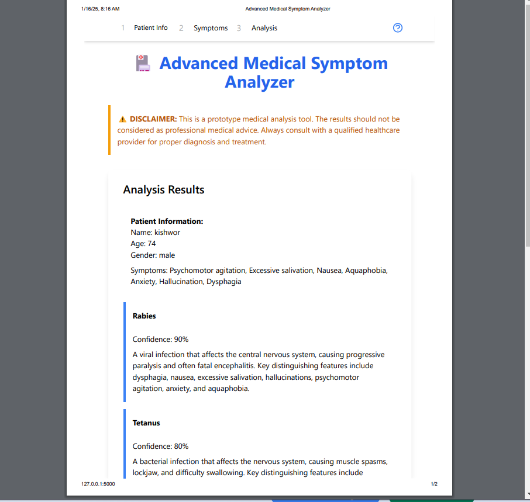

# ai_health-bot


# 🏥 Advanced Medical Symptom Analyzer

[](LICENSE)
[](https://www.python.org/downloads/)
[](https://flask.palletsprojects.com/)

A sophisticated web application that leverages AI to analyze medical symptoms and provide preliminary health insights. This tool combines modern web technologies with Google's Gemini AI to deliver an intuitive, user-friendly medical symptom analysis experience.



## ✨ Features

- **Interactive UI**: Modern, responsive interface built with Tailwind CSS and advanced animations
- **Step-by-Step Analysis**: Guided process through patient information collection and symptom input
- **Smart Symptom Input**: Quick-select common symptoms or manually enter specific conditions
- **AI-Powered Analysis**: Utilizes Google's Gemini AI for intelligent symptom analysis
- **Comprehensive Results**: Detailed analysis including:
  - Potential conditions with confidence levels
  - Treatment recommendations
  - Urgency indicators for medical attention
- **Progress Tracking**: Visual progress indicators for analysis steps
- **Print-Ready Reports**: Generate and print analysis results
- **Responsive Design**: Seamless experience across desktop and mobile devices

## 🚀 Getting Started

### Prerequisites

- Python 3.7 or higher
- Flask
- Google Generative AI library
- Internet connection for Tailwind CSS and other CDN resources

### Installation

1. Clone the repository:
```bash
git clone https://github.com/kishwordulal1234/ai_health-bot
cd ai_health-bot
python3 maya.py
```

2. Install required packages:
```bash
pip install flask google-generativeai
```

3. Set up your Google Gemini API key:
```python
# Replace in app.py
GEMINI_API_KEY = "your-api-key-here"
```

4. Run the application:
```bash
python app.py
```

5. Open your browser and navigate to:
```
http://localhost:5000
```

## 🛠️ Technical Stack

- **Backend**: Python Flask
- **AI Engine**: Google Gemini AI
- **Frontend**: HTML5, JavaScript, Tailwind CSS
- **Animations**: Animate.css
- **Icons**: SVG custom icons
- **UI Components**: Custom-designed components

## 🔒 Security and Privacy

- Client-side data handling for sensitive information
- Secure API key management
- No permanent storage of medical data
- HTTPS ready for production deployment

## ⚠️ Disclaimer

This tool is designed for educational and preliminary analysis purposes only. It should not be used as a substitute for professional medical advice, diagnosis, or treatment. Always consult with a qualified healthcare provider for medical concerns.

## 🤝 Contributing

Contributions are welcome! Here's how you can help:

1. Fork the repository
2. Create your feature branch (`git checkout -b feature/AmazingFeature`)
3. Commit your changes (`git commit -m 'Add some AmazingFeature'`)
4. Push to the branch (`git push origin feature/AmazingFeature`)
5. Open a Pull Request

## 📝 License

This project is licensed under the MIT License - see the [LICENSE](LICENSE) file for details.

## 🙏 Acknowledgments

- Google Gemini AI for powering the analysis engine
- Tailwind CSS for the modern UI framework
- The open-source community for various tools and libraries

## 📞 Support

For support, please open an issue in the GitHub repository or contact the maintainers directly.

---

Made with ❤️ by [unknone hart]
